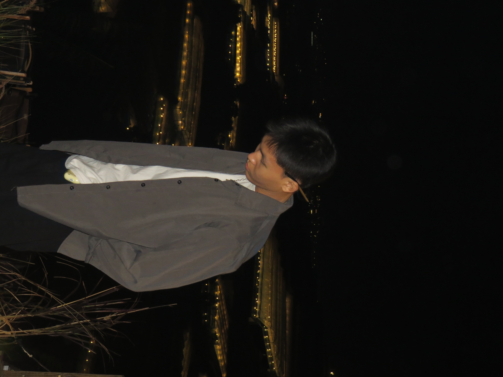

<!DOCTYPE html>
<html lang="vi">
<head>
    <meta charset="UTF-8">
    <title>Dự Án Đầu Tiên</title>
    
</head>
<body>
    
    
Tên: Lê Đăng Tiến

    
Biệt Danh: Đẹp Trai VCL

    
Trường: Đại Học Sài Gòn

    <a href="https://www.sgu.edu.vn/">MYSCHOOL</a>
    
Khoa: Công Nghệ Thông Tin

    <table border="1">
        <tr>
            <th>STT</th>
            <th>Buổi</th>
            <th>Hoạt Động</th>
        </tr>
        <tr>
            <td>1</td>
            <td>Sáng</td>
            <td>đớp</td>
        </tr>
        <tr>
            <td>2</td>
            <td>Trưa</td>
            <td>đớp</td>
        </tr>
        <tr>
            <td>3</td>
            <td>Chiều</td>
            <td>đớp</td>
        </tr>
        <tr>
            <td>4</td>
            <td>Tối</td>
            <td>đớp</td>
        </tr>
    </table>
</body>
</html>

